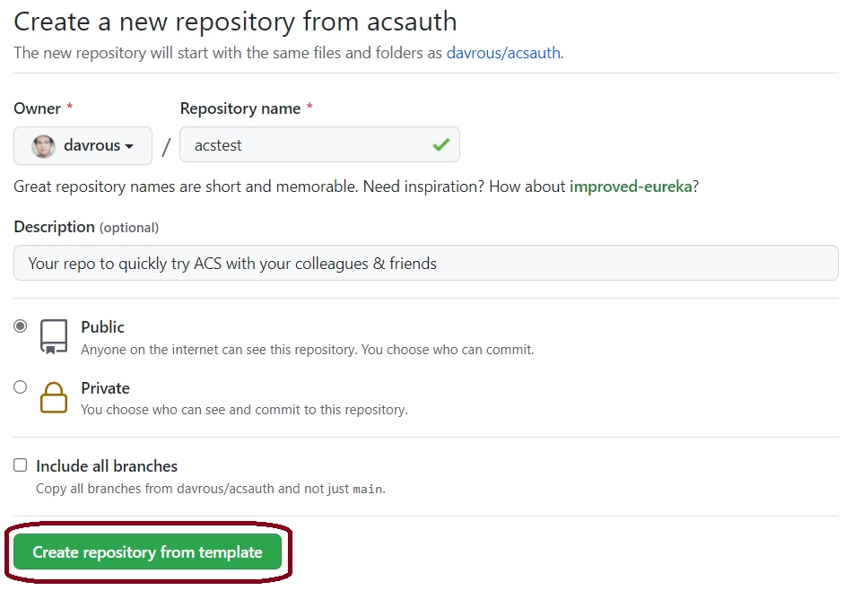
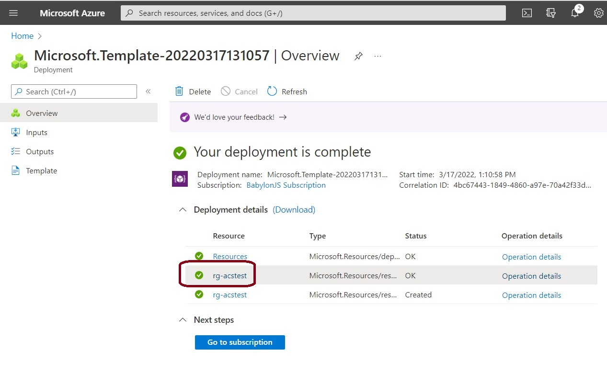
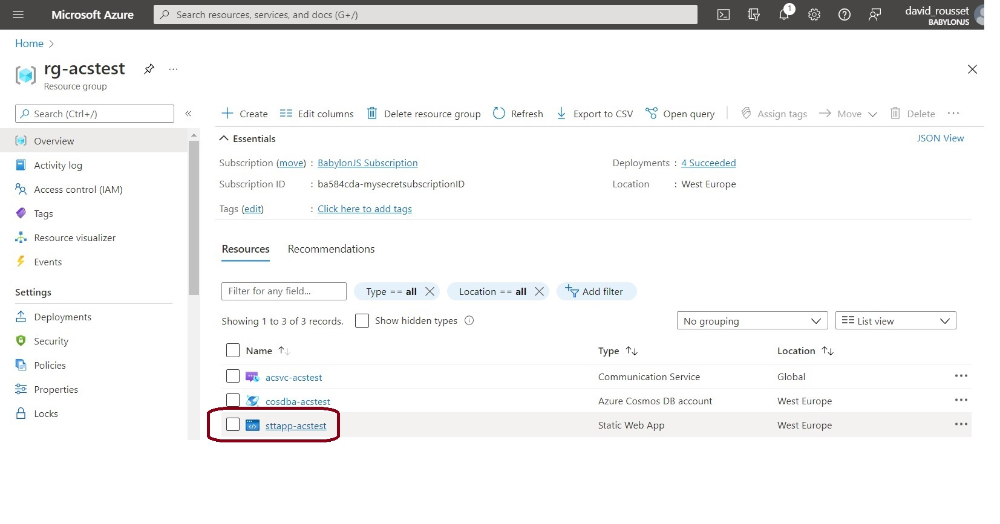
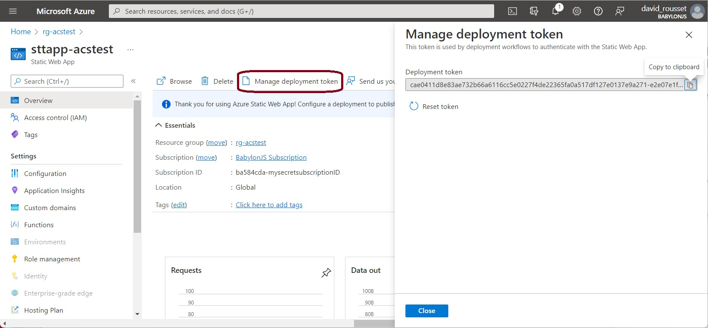
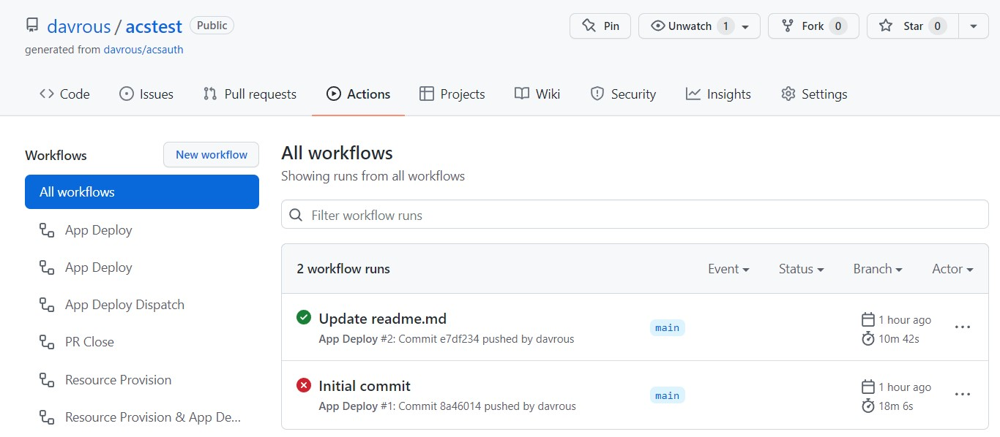
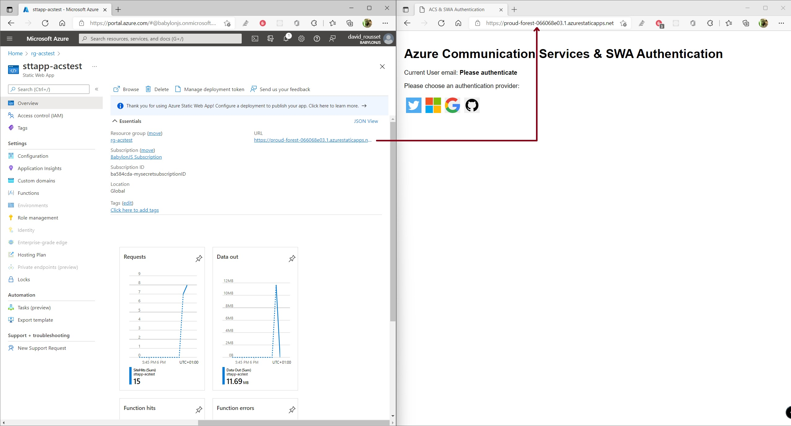
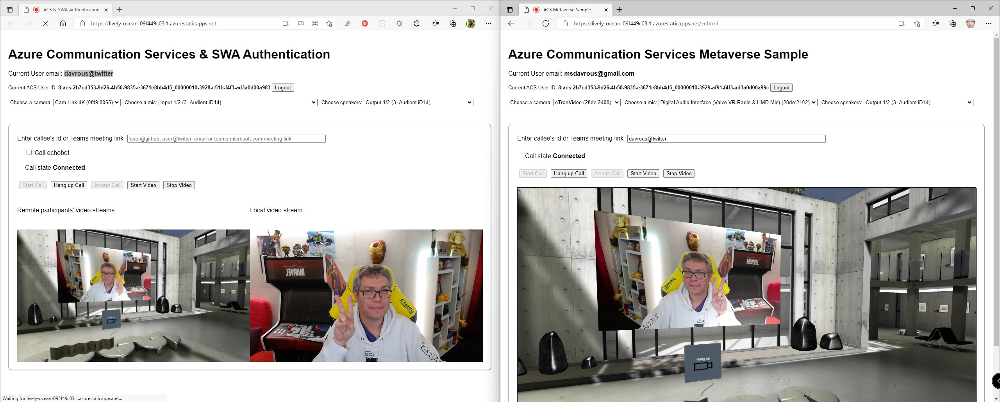

# Azure Communication Services Quick Starter

[Azure Communication Services (ACS)](https://azure.microsoft.com/en-us/services/communication-services) is a set of rich communication APIs, video APIs, and SMS APIs for deploying your applications across any device, on any platform. If you’re looking on enabling **chat**, **audio/video** conferencing, **phone calls** or **SMS** inside an existing app, you should have a look to this service. Please read [our ACS documentation](https://docs.microsoft.com/en-us/azure/communication-services/) to know more. 

This repo is used as a starter for a _very basic_ HTML web application using no front-end frameworks. It shows how to map an identity provided by a [Static Web App](https://docs.microsoft.com/en-us/azure/static-web-apps/overview) (Github, Microsoft, Twitter or Google) to an ACS identity. You can then **deploy this sample is a couple of minutes** following the instructions below and share the URL to the web app to **do calls to another user using ACS** or to **join a Microsoft Teams meeting** like described in this video: 

[](https://youtu.be/Jbf50SL1ceI)

This repo also contains a more advanced **Metaverse demo** allowing to **call someone in Teams from a VR environment** running in the browser like demonstrated in this short video: 

[](https://youtu.be/Wd4qNeLV_P8)

## How to deploy the sample in minutes

You've got 2 options:
- Follow the steps just below
- Or watch this step-by-step video: https://youtu.be/Booa7ZrW0og

### Step 1 - copy this repo in your Github repositories

First, you need to be logged in on Github and then press on the green "**use this template**" button:


Then fill the required properties, be sure to make it public and press "**Create repository from template**" button:



### Step 2 - provision all required resources using the 'Deploy To Azure' button

This will copy this repo into your Github account. Simply click on the "**Deploy To Azure**" button below (ctrl+click to open it in a separate tab to avoid loosing instructions):

[](https://portal.azure.com/#create/Microsoft.Template/uri/https%3A%2F%2Fraw.githubusercontent.com%2Fdavrous%2Facsauth%2Fmain%2Finfra%2Fazuredeploy.json)

In the various regions you'll choose, this will create a dedicated resource group (named rg-*yourname*) and will automatically deploy inside it:

- an [Azure Communication Services](https://docs.microsoft.com/en-us/azure/communication-services/) resource 
- a [Cosmos DB](https://docs.microsoft.com/en-us/azure/cosmos-db/) that will store the mapping records of social accounts with ACS identities & tokens
- a [Static Web App](https://docs.microsoft.com/en-us/azure/static-web-apps/) containing an [Azure Function](https://docs.microsoft.com/en-us/azure/azure-functions/) that will be already configured to point to the Cosmos DB & ACS connection strings 

### Step 3 - Grab the Static Web App deployment token from the Azure Portal

Once completed, you'll have a similar screen indicating your deployment is complete:



We're almost done! We now need to associate your Github repo with the freshly provisioned Azure Static Web App. For that, open the new resource group just created by clicking on it. It should be named "rg-*yourname*" like in the above screenshot. You'll then see the 3 resources created inside this resource group:



Click on the Static Web App named "sttapp-*yourname*" then click on the "**Manage deployment token**" button and copy to the clipboard the secret token.



### Step 4 - Copy the Static Web App deployment token as a secret in your Github repo

Now to be able to run your GitHub Actions workflow to deploy the ACS sample demonstrated in the videos, you need to store the Static Web App deployment token in a secret value named `AZURE_STATIC_WEB_APPS_API_TOKEN`. For that, go into the **Settings** of your Github repo and then navigate to the **Secrets->Actions** section to create a **New repository secret** key.


### Step 5 - Run the Github Actions deployment workflow

You finally need to run the workflow configured in this repo to deploy the code of the SWA to your Azure subscription. There are various ways to do that as the workflow is listening for either **push to the main branch** or **Pull Request**.

The easier way: simply **do a fake commit to the readme.md file** and this will trigger the deployment:



Once the workflow succeeded, navigate to the SWA URL that can be found in your Azure Portal:



And you should now be able to run the same demo as shown in this [YouTube video](https://youtu.be/Jbf50SL1ceI).

Still lost? Please check [this step-by-step tutorial video](https://youtu.be/Booa7ZrW0og).

To know more about those samples, please read this blog article: [AVAILABLE SOON]

## Concepts used in this sample
### Azure Communication Services
- [Identity concept](https://docs.microsoft.com/en-us/azure/communication-services/concepts/identity-model)
- [Calling concept](https://docs.microsoft.com/en-us/azure/communication-services/concepts/voice-video-calling/about-call-types)
- [Teams interoperability concept](https://docs.microsoft.com/en-us/azure/communication-services/concepts/teams-interop)
- [Quickstart: Create and manage access tokens](https://docs.microsoft.com/en-us/azure/communication-services/quickstarts/access-tokens?pivots=programming-language-javascript)
- [QuickStart: Add 1:1 video calling to your app](https://docs.microsoft.com/en-us/azure/communication-services/quickstarts/voice-video-calling/get-started-with-video-calling)
- [Quickstart: Join your calling app to a Teams meeting](https://docs.microsoft.com/en-us/azure/communication-services/quickstarts/voice-video-calling/get-started-teams-interop)

### Azure Static Web App
- [Authentication and authorization for Azure Static Web Apps](https://docs.microsoft.com/en-us/azure/static-web-apps/authentication-authorization)
- [Azure Cosmos DB input binding for Azure Functions 2.x and higher](https://docs.microsoft.com/en-us/azure/azure-functions/functions-bindings-cosmosdb-v2-input)
- [Azure Cosmos DB output binding for Azure Functions 2.x and higher](https://docs.microsoft.com/en-us/azure/azure-functions/functions-bindings-cosmosdb-v2-output)

## Metaverse demo
Once deployed, the VR / metaverse demo will be available under **/vr.html**



It works the same as the previous demo. You can either call someone using ACS or call someone inside a Microsoft Teams meeting. You can move inside the 3D scene using the arrows key (like a FPS game) or a gamepad controller. If launched in VR, you can use the VR controllers to teleport yourself like a classical VR game. 

*`Note`: it uses a trick to replace on the fly the video feed of the selected webcam by a stream of the WebGL canvas as this scenario is currently not supported out of the box by the ACS SDK. You then need a webcam available on the device that will render the 3D scene.*

To be able to replay as-is the demo showcased in [this YouTube video](https://youtu.be/Wd4qNeLV_P8), you need a WebXR compatible headset & browser. I’ve used my Valve Index inside Microsoft Edge in the demo. 

This demo uses the [Babylon.js WebGL engine](https://www.babylonjs.com) supporting WebXR out of the box. 

## Going Further

- if you need a more advanced authentication layer, ready for production, have a look to our [Get started with the trusted authentication service hero sample](https://docs.microsoft.com/en-us/azure/communication-services/samples/trusted-auth-sample) documentation. It shows the same concept using Azure Active Directory (AAD) mapping with ACS. 
- if you need a polished and ready to use UI library on top of the ACS SDK, read our [UI Library Overview](https://docs.microsoft.com/en-us/azure/communication-services/concepts/ui-library/ui-library-overview?pivots=platform-web)
- this sample shows a great usage for this UI library: [Get started with the calling hero sample](https://docs.microsoft.com/en-us/azure/communication-services/samples/calling-hero-sample)

## Running it on your dev machine

If you clone the repo on your developer machine, here are the steps to make it works:

- ```npm install``` -> this will install Webpack, some Azure Communication Services modules & the Azure Static Web App simulator & CLI
- Rename *local.settings.sample.json* to *local.settings.json* and fill the 2 properties with the Azure Communication Services & CosmosDB connection strings you'll find in the Azure Portal
- ```npm start``` -> this will start the Static Web App on http://localhost:4280 
- ```npm run build``` -> if you'd like to modify the code of *videocalls.js*, *videocallsvr.js* & *testacs.js* and bundle them with Webpack

## Credits

I'd like to thank [Justin Yoo](https://twitter.com/justinchronicle) for his precious help on building the deployment scripts & logic of this repo. If you're interested in building similar deployments from your repo, Justin has written an awesome technical article about the job he's done: [Azure Apps Autopilot](https://dev.to/azure/azure-apps-autopilot-2ag8). 
