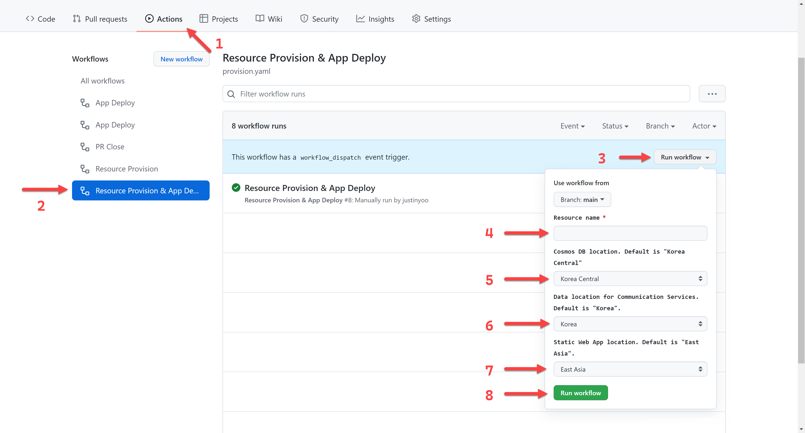

# Vanilla JavaScript App


[Azure Static Web Apps](https://docs.microsoft.com/azure/static-web-apps/overview) allows you to easily build JavaScript apps in minutes. Use this repo with the [quickstart](https://docs.microsoft.com/azure/static-web-apps/getting-started?tabs=vanilla-javascript) to build and customize a new static site.

This repo is used as a starter for a _very basic_ HTML web application using no front-end frameworks.


## Getting Started

### via Azure Portal

[](https://portal.azure.com/#create/Microsoft.Template/uri/https%3A%2F%2Fraw.githubusercontent.com%2Fdavrous%2Facsauth%2Fmain%2Finfra%2Fazuredeploy.json)
[](http://armviz.io/#/?load=https%3A%2F%2Fraw.githubusercontent.com%2Fdavrous%2Facsauth%2Fmain%2Finfra%2Fazuredeploy.json)


### via PowerShell

```powershell
$resourceName = "<resource_name>"
$location = "<cosmosdb_resource_location>"
$dataLocation = "<acs_data_location>"
$appLocation = "<static_app_location>"

./infra/Provision-Resources.ps1 `
    -ResourceName $resourceName `
    -Location $location `
    -CosmosDbPrimaryRegion $location `
    -CommunicationServiceDataLocation $dataLocation `
    -StaticWebAppLocation $appLocation
```


### via Azure CLI

```bash
resourceName=<resource_name>
location=<cosmosdb_resource_location>
dataLocation=<acs_data_location>
appLocation=<static_app_location>

az deployment sub create \
    -l $location \
    -n Subscription \
    -f ./infra/azuredeploy.bicep \
    -p name=$resourceName \
    -p location=$location \
    -p cosdbaPrimaryRegion=$location \
    -p acsvcDataLocation=$dataLocation \
    -p sttappLocation=$appLocation \
    --verbose
```


### via GitHub Actions Workflow



1. Go to the ["Actions"](/davrous/acsauth/actions) tab.
2. Click the ["Resource Provision & App Deploy](/davrous/acsauth/actions/workflows/provision.yaml) tab.
3. Click the "Run workflow" button.
4. Enter the resource name into the "Resource name" field.
5. Select the Cosmos DB location. Default is "Korea Central".
6. Select the Azure Communication Services data location. Default is "Korea".
7. Select the Static Web App location. Default is "East Asia".
8. Click the "Run workflow" button.

Once completed, you will see the Azure Static Web App is up and running.

